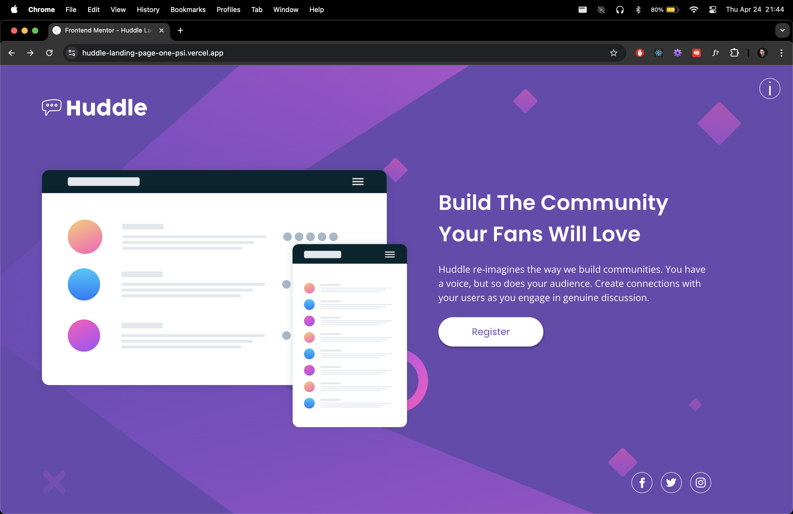
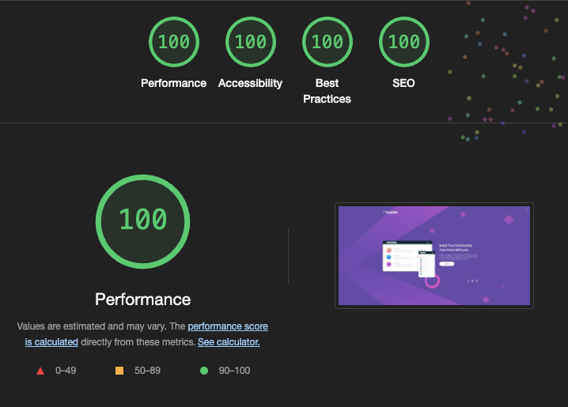
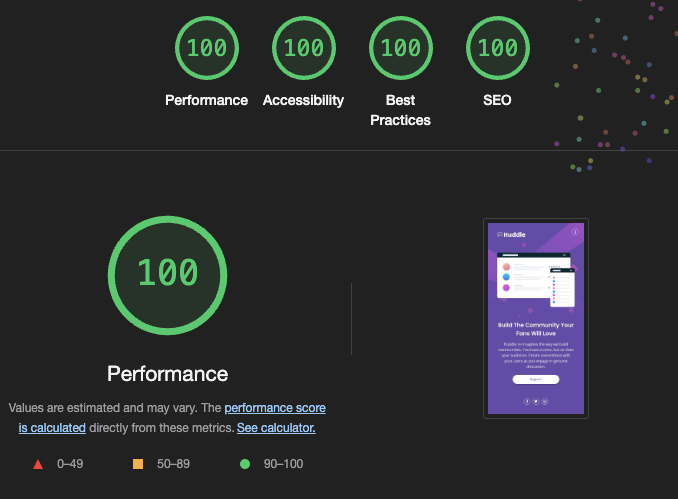

# Frontend Mentor - Huddle landing page with single introductory section solution

This is a solution to the [Huddle landing page with single introductory section challenge on Frontend Mentor](https://www.frontendmentor.io/challenges/huddle-landing-page-with-a-single-introductory-section-B_2Wvxgi0). Frontend Mentor challenges help you improve your coding skills by building realistic projects. 

## Table of contents

- [Overview](#overview)
  - [The challenge](#the-challenge)
  - [Screenshot](#screenshot)
  - [Links](#links)
- [My process](#my-process)
  - [Built with](#built-with)
  - [What I learned](#what-i-learned)
  - [Continued development](#continued-development)
  - [Useful resources](#useful-resources)
- [Author](#author)
- [Acknowledgments](#acknowledgments)

## Overview

### The challenge

Users should be able to:

- View the optimal layout for the page depending on their device's screen size
- See hover states for all interactive elements on the page

### Screenshot

### Links

- [Solution Github Repository ](https://github.com/SeanRavenhill/huddle-landing-page-with-single-introductory-section-nextjs)
- [Live Site URL hosted on Vercel: ](https://huddle-landing-page-one-psi.vercel.app/)

## My process

### Built with

- Semantic HTML5 markup
- CSS custom properties
- Flexbox
- CSS Grid
- Mobile-first workflow
- [React](https://reactjs.org/) - JS library
- [Next.js](https://nextjs.org/) - React framework
- [Tailwindcss](https://tailwindcss.com/) - Utility-first CSS framework
- [Fluid for Tailwind](https://fluid.tw/) - A plugin that extends Tailwind's utility-first approach with smooth scaling between breakpoints
- [SVGR](https://react-svgr.com/) - Universal tool to transform SVG into React components

### What I learned

- Balancing theoretical knowledge from [**Codecademy's Front End Career Path**](https://www.codecademy.com/learn/paths/front-end-engineer-career-path) with hands-on practice to build real-world projects.

- Gaining confidence in **React** and **Next.js**, especially when integrating frameworks into small-scale projects.

- Configuring **SVGR** in **Next.js** to import SVGs as React components.

- Implementing fluid design patterns with **Tailwind CSS** and custom dynamic utilities.

- Writing custom React hooks (useFocusTrap, useNoScroll) to enhance UI behavior and accessibility.

- Navigating a re-learning curve with Tailwind CSS and CSS after focusing on stateful applications and hooks.

- **Fluid Responsive Design:** Utilizes Tailwind CSS and CSS clamp() for dynamic sizing, avoiding rigid breakpoints.

- **SVG Optimization:** Replaced PNGs and raster SVGs with inline SVG components using SVGR.

- **Custom Info Modal:** A reusable modal component featuring state management, transition animations, a focus-trap hook, and a no-scroll hook.

- **Performance & Accessibility:** Achieved Lighthouse performance scores of 100 on both Desktop and Mobile for the Vercel deployment.

### Proud of

### Continued development

- **Starter Template:** Create a robust starter project repository on GitHub, pre-configured with all dependencies, a global CSS file, Tailwind config, and essential configs for easy cloning and rapid project setup.

- **CSS Organization:** Continue using Tailwind for utility-first styling (e.g., layout, spacing) while offloading complex or repeated styles into global CSS, custom Tailwind config utilities, and component-specific CSS modules to keep JSX/HTML markup concise.

- **Efficient Dev Loop:** Implement a local development and build-testing workflow—such as pre-push Git hooks, CI scripts, or dedicated build commands—to catch errors before pushing and minimize redundant repository updates.

- **Focus on Progress:** Avoid endless refactor loops; prioritize completing new challenges and shipping features over chasing “perfect” markup and code.

### Useful resources

- [Achieving Focus Trapping in a React Modal Component](https://medium.com/cstech/achieving-focus-trapping-in-a-react-modal-component-3f28f596f35b) - This artcile provided me insight and understanding into the What, Why and How of using Focus Traps.

- [Atomic Design Methodology - Brad Frost](https://atomicdesign.bradfrost.com/) - Found this useful for project directory structure

## Author

- [Sean Ravenhill](https://github.com/SeanRavenhill)
- Frontend Mentor - [@SeanRavenhill](https://www.frontendmentor.io/profile/SeanRavenhill)

## Acknowledgments

- [Frontend Mentor](https://www.frontendmentor.io/) for the challenge design and assets.

- [Codecademy](https://www.frontendmentor.io/https://www.codecademy.com/) for the Front End Career Path curriculum, which helped reinforce core web fundamentals.

- [OpenAI - ChatGPT](https://openai.com/chatgpt/overview/) - I will admit I did feed my markup into a instance of ChatGPT for help to bring all the components in-line with A11y accesibilty standards. Also needed some help when it came to the useFocusTrap custom hook and wiring that into the project.

- [Ogun Akar](https://medium.com/@ogunakar) - for this [article](https://medium.com/cstech/achieving-focus-trapping-in-a-react-modal-component-3f28f596f35b) related to focus traps, what they are used for and demostration of implentation.

